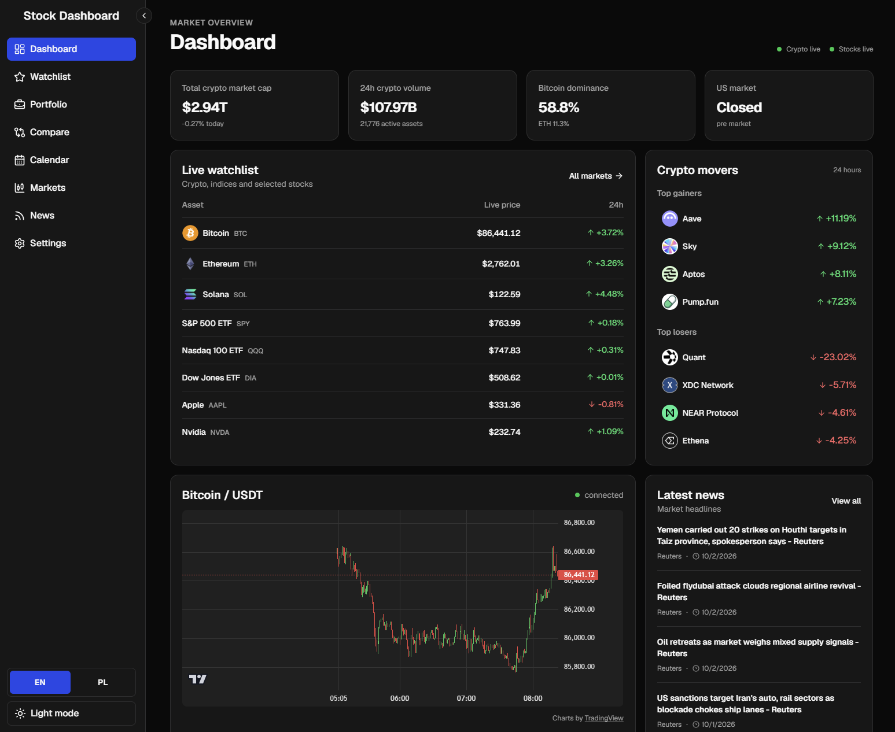
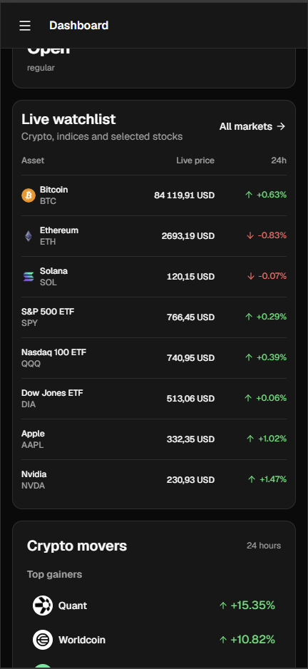

# Stock Dashboard

A portfolio project built with **React and TypeScript** for exploring stock and cryptocurrency markets. It combines live price updates, interactive candlestick charts, a personal watchlist, and portfolio tracking in a responsive interface.

**Live demo:** [**stock-dashboard-chi-three.vercel.app**](https://stock-dashboard-chi-three.vercel.app/)

No sign-up is required. Watchlists, portfolio positions, and preferences are saved locally in the browser.

## Preview

**Desktop dashboard**



**Mobile dashboard**



## Explore the app

| Feature         | What you can do                                                                                                |
| --------------- | -------------------------------------------------------------------------------------------------------------- |
| Dashboard       | Review market metrics, live prices, crypto gainers and losers, and recent headlines.                           |
| Markets         | Browse cryptocurrencies and selected US stocks, then open asset details and crypto candlestick charts.         |
| Watchlist       | Search for assets, save favorites, and follow their prices in one place.                                       |
| Portfolio       | Add holdings and purchase prices; track portfolio value, weighted average cost, and unrealized profit or loss. |
| Compare         | Compare up to four assets by price, daily change, and available market metrics.                                |
| Calendar & news | Browse earnings and IPO events by month, filter event types, and read market news by category.                 |
| Settings        | Switch between light and dark themes, choose a default page, and manage locally saved data.                    |

**Suggested walkthrough:** open the dashboard, inspect a cryptocurrency chart, add an asset to the watchlist, then create a portfolio position. Refresh the page to see the saved state persist. On mobile, the topbar shows the current page and provides a sidebar toggle.

## Technical highlights

- **REST data and live updates:** TanStack Query manages API queries, caching, and refresh intervals. Custom WebSocket hooks handle live prices, connection state, reconnection, and subscription cleanup.
- **Server-side API credentials:** the browser accesses Finnhub through a same-origin Node.js proxy. The backend adds the API key and restricts forwarded REST endpoints and parameters.
- **Interactive charts:** Lightweight Charts renders crypto candlesticks, with resizing and theme updates handled in a dedicated component.
- **Browser persistence:** watchlists, portfolio holdings, comparison selections, and preferences use `localStorage`. The watchlist uses `useSyncExternalStore` to synchronize subscribing components.
- **Route-based loading:** pages and the chart component are lazy-loaded with React `Suspense`.
- **Responsive navigation:** a desktop sidebar and mobile topbar share navigation state; the mobile sidebar supports manual toggling and automatic hiding on scroll.

## Stack

| Area           | Technologies                                         |
| -------------- | ---------------------------------------------------- |
| Frontend       | React 19, TypeScript, React Router 7, Vite           |
| Styling & UI   | Tailwind CSS 4, shadcn/ui, Base UI, Lucide icons     |
| Data & charts  | TanStack Query, WebSocket APIs, Lightweight Charts   |
| Backend        | Node.js HTTP server, `ws`, Finnhub proxy             |
| Data providers | CoinGecko, Binance, Finnhub                          |
| Tooling        | ESLint, Prettier, Node.js test runner                |
| Deployment     | Vercel configuration and a standalone Node.js server |

## Code worth exploring

- [Application routing](src/App.tsx) — lazy-loaded pages and the application layout.
- [API services](src/services) — typed data access and query configuration.
- [Live stock prices](src/hooks/useFinnhubStockPrices.ts) — WebSocket subscriptions and reconnection.
- [Crypto chart](src/components/CryptoChart.tsx) — chart lifecycle, resizing, and theme integration.
- [Watchlist state](src/hooks/useWatchlist.ts) — browser persistence and external-store subscriptions.
- [Portfolio calculations](src/pages/PortfolioPage.tsx) — holdings, average cost, and unrealized returns.
- [Backend proxy](backend/app.mjs) and [backend tests](tests/backend.test.mjs) — request validation, parameter filtering, and WebSocket forwarding.

## Run locally

Use **Node.js 22.23.1**, as specified in [`.nvmrc`](.nvmrc). Run commands from the directory containing `package.json`.

```bash
npm ci
```

Copy `.env.example` to `.env.local` (`cp .env.example .env.local` on macOS/Linux, or `Copy-Item .env.example .env.local` in PowerShell), then configure:

```env
NEWS_STOCK_API_KEY=your_finnhub_key
VITE_COINGECKO_API_KEY=
VITE_SITE_URL=
```

- `NEWS_STOCK_API_KEY` is required for Finnhub stock, news, and calendar data. It stays on the server; never give it a `VITE_` prefix.
- `VITE_COINGECKO_API_KEY` is optional and client-visible. Leave it empty without a CoinGecko demo key; do not keep the example placeholder.
- `VITE_SITE_URL` is optional. Set it to the production origin to enable canonical URLs and `og:url` metadata.

```bash
npm run dev
```

Open the URL printed by Vite. The development server proxies Finnhub REST and WebSocket requests. Restart it after changing environment variables.

## Checks

```bash
node --test tests/backend.test.mjs
npm run lint
npm run format:check
npm run build
```

The backend tests cover API request validation, approved parameter forwarding, the server entry point, and WebSocket message handling. They do not verify the deployed hosting runtime or mobile browser behavior.

## Deployment

**Vercel:** select the directory containing `package.json` as the project root and use Node.js 22.x. The included [`vercel.json`](vercel.json) configures the Vite build, `dist` output, API routing, and SPA fallback. Add `NEWS_STOCK_API_KEY` to the deployment environment and optionally set `VITE_SITE_URL=https://stock-dashboard-chi-three.vercel.app`. Redeploy after environment changes.

**Standalone Node.js:** run `npm run build`, then `npm start`. The server serves the frontend and Finnhub proxy on `http://localhost:4173` by default; configure `PORT` to change it. `npm run preview` starts the same server and also requires a build first.

`/api/finnhub/status` reports whether a non-placeholder server key is configured; it does not validate the key with Finnhub. Stock streaming requires a hosting runtime that supports the included WebSocket bridge. Static hosting alone cannot run the proxy.

## Project scope

This is a market dashboard with manually entered portfolio positions; it does not execute trades or connect to brokerage accounts. Personal data stays in the current browser, with no account system or cross-device synchronization.

Market data availability depends on provider quotas, API permissions, connectivity, and hosting support. Live streams and REST snapshots may update at different times. The app includes loading, connection, and error states for these conditions.

The frontend is a client-rendered SPA. Route-specific metadata is updated after JavaScript runs; there is no server rendering or prerendering.
